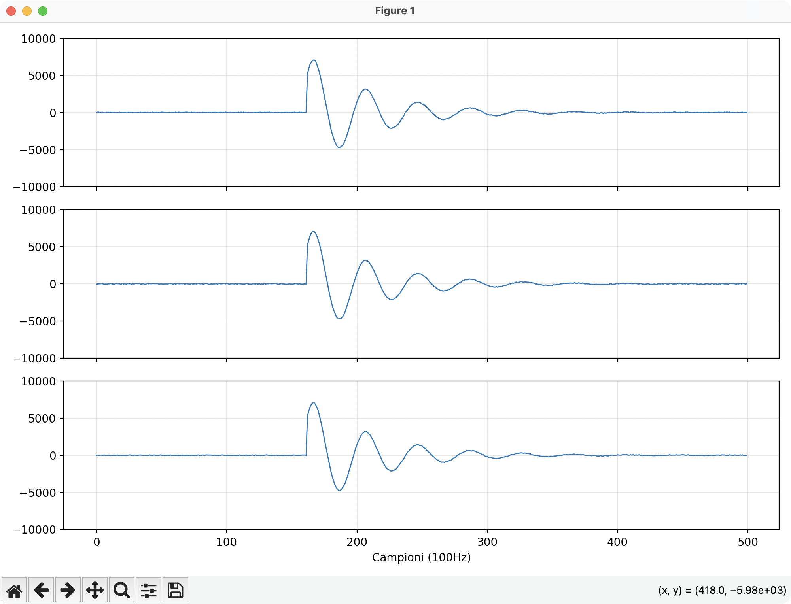
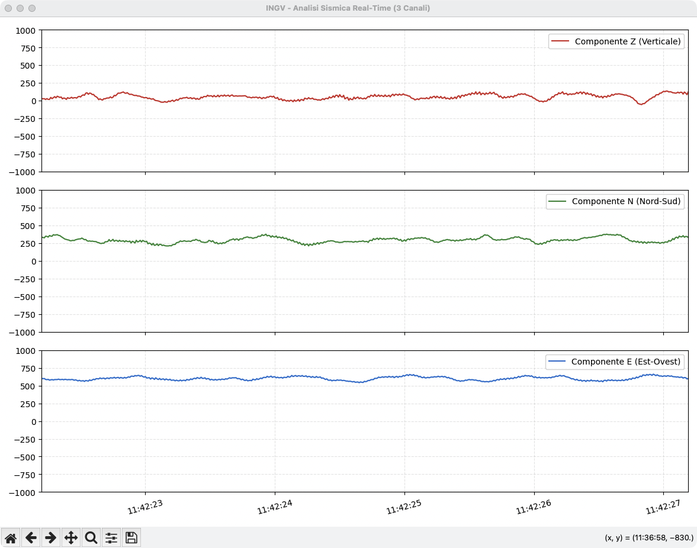
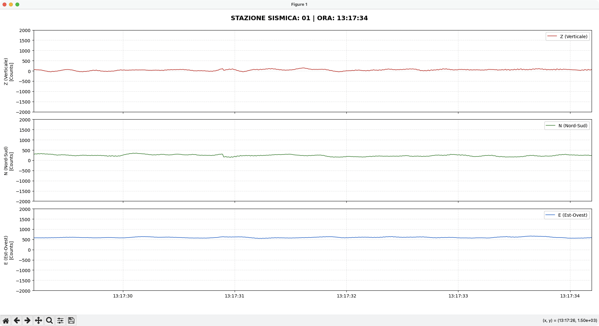

# 📡 Portenta H7 Multi-Node BLE Framework


Questo repository contiene un framework strutturato per lo sviluppo, il test e l'implementazione di reti di sensori basate su **Arduino Portenta H7**. 

Il progetto è stato sviluppato nell'ambito di un tirocinio presso l'**INGV**, focalizzato, per il momento, sull'acquisizione dati, la comunicazione wireless tramite Bluetooth Low Energy (BLE) e l'ottimizzazione estrema dei consumi energetici (Deep Sleep) sfruttando l'architettura asimmetrica Dual-Core (Cortex-M7 + Cortex-M4) della scheda.

---

## 🏗️ Architettura del Progetto (Monorepo)

Per gestire una flotta di schede con firmware differenti senza duplicare il codice, il progetto è strutturato come un **Multi-Root Workspace** in PlatformIO.

* **⚙️ Configurazione Centralizzata**: Tutti i progetti ereditano le impostazioni hardware e le librerie base dal file `common_config.ini`. Questo garantisce che tutte le compilazioni siano uniformi (es. ottimizzazione `-O3` attivata per la massima velocità).
* **📁 Workspace VS Code**: Il file `PortentaSpace.code-workspace` gestisce l'interfaccia dell'IDE, separando la cartella Root (per le configurazioni globali e le librerie custom condivise) dai singoli script operativi. Questa architettura permette di gestire decine di script e firmware diversi all'interno di un unico repository: basta selezionare l'Environment desiderato nella barra di stato per riconfigurare istantaneamente i tasti di Build e Upload per lo specifico progetto o core su cui si sta lavorando.


---

## 🚀 Guida all'Installazione

Dato che il progetto usa una struttura avanzata a multi-ambiente, **non** basta aprire semplicemente la cartella principale. Segui questi passaggi per configurare l'IDE correttamente.

### Prerequisiti
1. Installa [Visual Studio Code](https://code.visualstudio.com/).
2. Installa l'estensione **PlatformIO IDE** all'interno di VS Code.
3. (Facoltativo) Installa l'app **nRF Connect** per testare la connettività Bluetooth. 

### Passaggi per il Setup
1. **Clona il repository** sul tuo computer:
   
2. **Apri VS Code**. 
   > ⚠️ **ATTENZIONE**: Per il corretto funzionamento di PlatformIO, **NON** usare il classico "Apri Cartella" (Open Folder) sulla root del repository.

3. Vai nel menu in alto su **File > Open Workspace from File...**

4. Seleziona il file `PortentaSpace.code-workspace` che trovi nella cartella principale.

---

## 🔵 Connettività BLE su Portenta H7

La Portenta H7 utilizza un modulo radio integrato che supporta lo standard **Bluetooth Low Energy (BLE)**. A differenza del Bluetooth classico, il BLE è ottimizzato per trasmissioni a basso consumo di piccoli pacchetti di dati, rendendolo ideale per nodi sensori alimentati a batteria.

### Funzionamento della libreria `ArduinoBLE`
Il framework si basa sulla libreria ufficiale `ArduinoBLE`, che astrae la complessità del protocollo tramite un'architettura a **Servizi** e **Caratteristiche**:

* **Central vs Peripheral**: 
    * Il **Peripheral** (il nostro sensore) espone dei dati.
    * Il **Central** (il nostro hub) scansiona l'etere, trova il peripheral tramite il suo indirizzo o un **UUID** (Unique Identifier) specifico e vi si connette.
* **Servizi e Caratteristiche**: I dati sono organizzati in *Service* (gruppi logici, es. "Dati Ambientali") che contengono una o più *Characteristic* (singoli dati, es. "Temperatura").
* **Protocollo di Scambio**: Il sistema utilizza i metodi `write()` per inviare comandi e `poll()` o i callback di notifica per leggere i dati in tempo reale.

### Integrazione Dual-Core e BLE
Nella configurazione avanzata (V2), lo stack BLE viene inizializzato e gestito interamente dal core **Cortex-M4**. Questo permette al core **Cortex-M7** (molto più energivoro) di rimanere in stato di stop o gestire task di calcolo pesante solo quando strettamente necessario, ottimizzando drasticamente l'efficienza energetica del dispositivo durante le fasi di advertising e connessione.

---

## 𝚫 Delta Encoding
Per massimizzare l'efficienza del modulo Radio ho implementato un algoritmo di compressione differenziale basata sullo **Steim1**, alla base del formato **miniSEED**

Nella realtà si lavora con sensori a 3 canali che mandano, per ogni canale 32bit di informazione, tutto a 100Hz. 
Con la compressione delta, il sistema, al posto di mandare 10 campioni da 32bit, ne manda 1 a 32bit `init32_t`e 9 come differenza rispetto al primo come `init16_t`.

Così facendo passiamo da 120byte totali a soli 66byte, risparmiando ~45% della banda.

---

## 🫨 Simulazione Geofisica
Il simulatore implementato nel progetto `Test_wifi_analog` simula gli eventi sismici con un decadimento esponenziale ogni 10 secondi.

```cpp
eventSignal *= 0.98; // Smorzamento del picco
float seismicWave = eventSignal * sin(2.0 * PI * 2.5 * (t / 1000.0));
```

---

## ⤵️ Conversione MiniSEED -> Header
I dati reali contenuti nel file `dati_di_prova.mseed` non possono essere letti direttamente dal codice in `.cpp`, per questo devono essere convertiti in file Header `.h`, così da poter essere iniettati direttamente nella memoria Flash della Portenta.

L'utilizzo di file reali è necessario come ulteriore stress test per capire le capacità di trasmissione della scheda.

### Logica di trasformazione
Il passaggio dai dati binari al codice sorgente avviene tramite uno script Python basato sulla libreria ObsPy. Il processo segue tre fasi critiche:
1. **Sincronizzazione**: Estrazione di 3 tracce (Z, N, E) e livellamento alla stessa lunghezza campioni.
2. **Conversione**: Trasformazione dei dati grezzi in interi a 32 bit (`int32_t`).
3. **Embedding**: Generazione di un array bidimensionale static const per forzare la memorizzazione nella Flash, evitando di saturare la RAM.

Il file generato espone i dati in una **matrice organizzata per canali**, rendendo l'accesso tramite puntatori immediato.

```cpp
// Esempio di struttura nel file .h
static const int SEISMIC_DATA_LEN = 10000;
static const int32_t SEISMIC_SAMPLES[3][10000] = {
  { ... dati Canale Z ... },
  { ... dati Canale N ... },
  { ... dati Canale E ... }
};
```

---

## 📂 Panoramica dei Progetti

Il framework è diviso in step incrementali di complessità. Ogni cartella all'interno di `Progetti/` contiene un esperimento o una versione specifica:

### 1. 💡 Blink (`Blink`)
Il classico script di test hardware "Hello World" per verificare il corretto funzionamento, i driver USB e il caricamento del codice sulla Portenta H7.
> Il codice è stato preso dalla documentazione ufficiale Arduino seguendo [questo articolo](https://docs.arduino.cc/tutorials/portenta-h7/setting-up-portenta/)

### 2. 📡 Test BLE Preliminare (`test_BLE_preliminare`)
Progetto base utile testare l'attivazione del modulo radio e l'esposizione di un servizio BLE (controllo LED da smartphone o da un altro central). 

> Il codice è stato preso dalla documentazione ufficiale Arduino seguendo [questo articolo](https://docs.arduino.cc/tutorials/portenta-h7/ble-connectivity/)

### 3. 📶 Connessione BLE Bidirezionale (`Connessione_BLE_V1`)
Implementa una comunicazione continua tra due schede Portenta H7:
* **Central**: Scansiona l'ambiente filtrando per un UUID specifico, si connette e resta in ascolto continuo dei dati.
* **Sensor (Peripheral)**: Invia dati (attualmente generati da un sensore fittizio) ogni secondo e riceve contemporaneamente stringhe di testo/comandi inviati dal Central. 

### 4. 2️⃣ Test Dual Core (`Test_dual_core`)
Prima implementazione del Dual core. Serve per capire se il core M4 si attiva correttamente. Il `bootloader.cpp` attiva il core M4 per poi spegnere indefinitivamente il core M7.

Bisogna prima caricare il codice per M4 e poi quello per M7.

### 5. 🔋 BLE con Deep Sleep & Dual Core (`Connessione_BLE_V2`)
Questo modulo esplora il risparmio energetico spinto demandando i compiti di rete al core a basso consumo (M4).

* **Gestione M7 (Bootloader)**: Il core principale (M7) viene utilizzato esclusivamente per "svegliare" il core secondario, dopodiché viene messo in ibernazione profonda a tempo indeterminato tramite `rtos::ThisThread::flags_wait_any`.
* **Gestione M4 (Operativo)**: Il core M4 gestisce l'intero stack radio BLE in autonomia. L'invio dei dati è ottimizzato: avviene periodicamente o asincronamente se il Central invia un comando di lettura anticipata. Nei tempi morti, il thread sfrutta i cicli di idle di Mbed OS per abbattere ulteriormente gli assorbimenti.

> **Strategia di Offloading & Power Management**: 
> A differenza di un approccio standard, questa architettura non si limita all'invocazione di stati di sleep software, ma sfrutta l'asimmetria hardware della Portenta H7. Isolando lo stack radio e la logica di campionamento sul core **Cortex-M4** (intrinsecamente più efficiente), è possibile forzare il core **Cortex-M7** in uno stato di stop totale. Questo "offloading" permette alla scheda di operare in una modalità molto vicina al **Deep Sleep** hardware, massimizzando l'autonomia energetica senza perdere la reattività nella comunicazione BLE.

Al momento sembra che il BLE possa essere gestito solo dal core M7, quindi per ora il core M7 manda i dati mentre il core M4 li genera.

La differenza di consumo nei primi test sembra irrisoria.

### 6. 🛜 Inoltro dati tramite Wifi `Test_wifi_analog`
Questo progetto si avvicina alla realtà generando dati simili ai segnali geofisici a **100Hz**, comprimendoli tramite **Delta encoding** e inoltrandoli tramite WiFi UDP ad una stazione di monitoraggio remota.

La ricezione e la visualizzazione dei dati viene gestita da uno script Python che ricostruisce il segnale originale.
```python
# Ricostruzione: Valore Attuale = Valore Precedente + Delta
current_val = struct.unpack('<i', data[ptr:ptr+4])[0] # Base
for _ in range(9):
    delta = struct.unpack('<h', data[ptr:ptr+2])[0]
    current_val += delta # Integrazione
```
Avviando lo script Python si aprirà una finestra che mostrerà tutta l'attività:



### 7. 💾 Inoltro di dati veri `Test_wifi_real_data`
Questa è la diretta evoluzione del progetto precedente, ma al posto di simulare un evento sismico, **andiamo ad utilizzare un file `.mseed` di prova**, debitamente convertito a file `.h` per essere letto dal nostro `main.cpp`. Questi dati verranno trattati come dati **live**.

I dati vengono letti utilizzando lo script `Ricevitore_WiFi_Plot_v2.py`, che permette di visualizzare il grafico con un andamento **in tempo reale sui 3 canali**.



### 8. 🔢 Dati provenienti da più sensori `Test_rete_multi`
In questo progetto ci avviciniamo alla realizzazione finale andando a prendere **dati da più sensori**. Lo script `Ricevitore_WiFi_Plot_multi.py` permette di visualizzare i 3 canali sui due sensori. Possiamo cambiare il sensore visualizzato utilizzando i tasti numerici.

Ipotizzo che l'hardware è in grado di gestire fino a 5 connessioni simultanee.



### 9. 🚦 Test di Multithreading `Test_multithreading`
Questo progetto serve per sperimentare con il MultiThreading di MbedOS. 

All'interno troviamo due sottoprogetti studiati per testare progressivamente ambienti più complessi.

In `src/base` troviamo un semplicissimo progetto di multithread, senza scrittura di dati, ma solo con un blink e alcuni output seriali indipendenti tra loro.

in `src/mutex`, banalmente, si sperimenta con il mutex.

Al momento, data la ristrettezza dei progetti, posso permettermi di inserire tutti i file necessari all'interno della cartella `src` del progetto. 

In un secondo momento, con progetti più grossi, sarà consigliato inserire questi file all'interno di una cartella dedicata, come la cartella `lib`

### 10. 📈 Test Multithreading con dati veri `Test_multithreading_real_data`

Questo progetto, come diretta evoluzione dei precedenti, delega la gestione del BLE e la racolta dei dati a due thread indipendenti. 

---

## 🧪 Setup Sperimentale

La validazione del sistema e la caratterizzazione dei consumi energetici per la versione **V2 (Deep Sleep)** vengono effettuate in un ambiente di test controllato. 

* **Metodologia di Misura**: La Portenta H7 viene alimentata tramite un **alimentatore stabilizzato da banco**. La corrente assorbita viene misurata in tempo reale utilizzando un **multimetro digitale** posto in serie alla linea di alimentazione, permettendo di monitorare i picchi durante la trasmissione BLE e i minimi durante le fasi di ibernazione dei core.
* **Sorgente Dati**: In questa fase dello sviluppo, i dati trasmessi dal nodo sensore sono **generati via software** (dati fittizi). Questo approccio permette di isolare il consumo dello stack radio e della logica Dual-Core, eliminando le variabili di assorbimento della sensoristica esterna non ancora integrata.

---

## 📝 Roadmap (TODO)

Questa sezione tiene traccia delle funzionalità in fase di sviluppo e delle ottimizzazioni pianificate per il framework.

- [x] **Setup Monorepo**: Configurazione `common_config.ini` e struttura multi-progetto.
    - [x] Sincronizzazione e condivisione tramite GitHub. 
- [x] **Connettività Base (V1)**: Comunicazione bidirezionale stabile tra Central e Sensor.
- [x] **Ottimizzazione Deep Sleep (V2)**: 
    - [x] Implementazione Bootloader su Core M7.
    - [ ] ~~Handover completo dello stack BLE al Core M4.~~
    - [ ] ~~Caratterizzazione dei consumi in modalità *Sleep* vs *Deep Sleep*.~~
- [ ] **Integrazione Hardware**: 
    - [x] Sostituzione dei dati fittizi con letture da sensori reali.
    - [ ] Sostituzione dei dati fittizi con letture live da sensori reali.
    - [ ] ~~Gestione degli interrupt esterni per il wake-up della scheda.~~
- [ ] **Implementazione rete con più sensori**
    - [X] Leggere i dati provenienti da più sensori
    - [ ] Testare le capacità massime di trasmissione e ricezione
- [ ] **Multithreading**: 
    - [x] Implementare esempi base di Multithreading e Mutex
    - [x] Implementare il Multithreading con lettura dei miniSEED salvati
    - [ ] Implementare il codice esistente sulla lettura dei sensori reali
    

---
Questo repository e la relativa documentazione nascono dall'esigenza di sistematizzare l'architettura del lavoro svolto. L'obiettivo è garantire la piena tracciabilità delle scelte progettuali e permettere una rapida replica dell'ambiente di sviluppo e della struttura del firmware in scenari futuri o per ulteriori sviluppi del progetto.